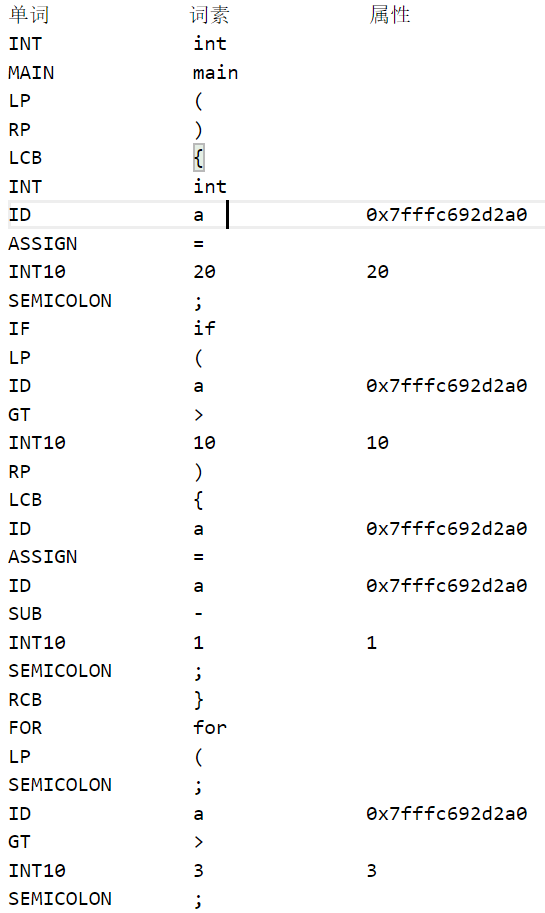
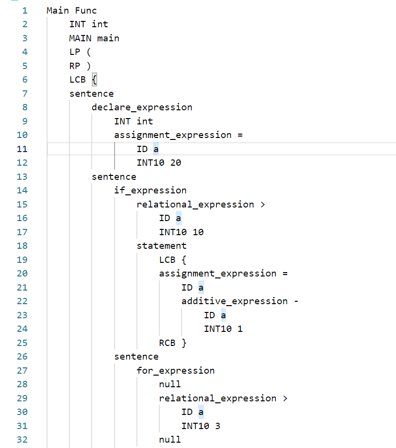
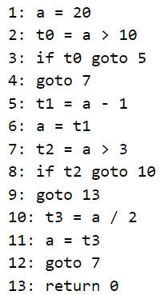
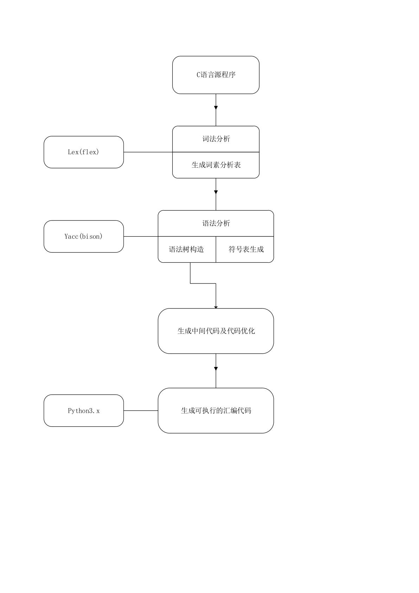

# 一个简易的C语言编译器

### 一、实验介绍

​	本实验是南开大学软件学院编译原理课程实验课作业，要求实现一个简易的C语言编译器，主要内容包括：

- [x] 词法分析
- [x] 语法分析
- [x] 类型检查
- [x] 代码优化
- [x] 错误分析
- [x] 汇编程序

### 二、实验要求

#### 	1.基本要求：

- 变量类型：int
- 语句：注释，声明，赋值，循环（while和for），判断（if），输入输出
- 算术运算：+，-，*，/，%，^
- 关系运算：==，<，>，<=，>=，!=
- 逻辑运算：&&（与），||（或），!（非）

#### 	2.拓展功能

- 支持过程和函数调用
- 支持数组运算
- 支持指针运算
- 支持结构体

### 三、小组成员及分工

- 1812986 郭舜恒（词法，语法）
- 1812993 焦承炬（语法，汇编）
- 1813028 王晨（语法，中间代码）

### 四、实验内容

#### 	0.环境准备及使用说明

​	windows WSL1.0 + ubuntu20.0.4

```
sudo apt install flex bison build-essential python nasm
```

​	在文件根目录下运行：

```shell
make file=<filename> 	//filename指要编译的c语言代码文件
```

#### 1.词法分析

​	经过调研与选型，我们决定使用lex作为词法分析器。通过词法分析器，生成源代码相应的词法分析文件。

​	部分类型说明：

| 词素                 | 词法单元       | 介绍                 |
| -------------------- | -------------- | :------------------- |
| return               | RET            | 返回                 |
| if/while/for         | IF/WHILE/FOR   | 判断及两种循环标识符 |
| break/continue       | BREAK/CONTINUE | 流程控制             |
| int                  | INT            | 整型变量             |
| input_int/output_int | INPUT/OUTPUT   | 输入输出             |
| id                   | ID             | 变量名               |
| + - * /              | + - * /        | 四则运算符           |
| % ^                  | % ^            | 模运算及乘方运算符   |
| && \|\|  ！          | AND/OR/NOT     | 逻辑运算符           |

​	词法分析结果:



#### 2.语法分析

​	使用yacc接受lex产生的token，并对程序的语法进行语法分析，最终打印出抽象语法树。

##### 	部分语句文法:

```c
//if语句文法
//设置优先级解决移入-归约冲突
%precedence ')'
%precedence ELSE
......
......
if_expression 
    : if_identifier ')' statement
    | if_identifier ')' statement ELSE statement
;
if_identifier
    : IF  '(' operate_expression
;
```

```c
//for语句文法
for_expression
    : FOR '(' nullable_expression ';'  nullable_expression ';' nullable_expression ')' statement
;
```

```c
//while文法
while_expression
    : WHILE '(' operate_expression ')' statement
;
```

##### 	语法树构造:

​	使用n叉树来构造抽象语法树。

```c
//语法树数据结构
typedef struct Tree{
    char* content;				//词素
    char* name;					//名字
    int line;					//行号
    int num;					//子节点数量
    int headline;				//语句段起始行号
    int nextline;				//下一个语句段行号
    char* inner;				//存储中间变量
    char* code;					//中间代码
    struct Tree** leaves;		//叶子节点
    struct Tree* next;			//链表指针
    struct Declator* declator;	//修饰符
}Tree;
```

```c
//初始化树
Tree* initTree(int num);
//创建树
Tree* createTree(char* name, int number, ...);
//在lex文件里创建终结符节点
Tree* terminator(char* name, int yylineno);
//二元运算符创建树
Tree* binaryOpr(char* name, Tree* t1, Tree* t2, Tree* t3);
//赋值运算符创建树
Tree* assignOpr(char* name, Tree* t1, Tree* t2, Tree* t3);
//一元运算符创建树
Tree* unaryOpr(char* name, Tree* t1, Tree* t2);
//if语句创建树
Tree* ifOpr(char* name,int headline,int nextline,Tree* op,Tree* stmt);
//if-else语句创建树
Tree* ifelseOpr(char* name, int headline, int next1, int next2, Tree* op, Tree* stmt1, Tree* stmt2);
//while语句创建树
Tree* whileOpr(char* name,int head1, int head2,int nextline,Tree* op,Tree* stmt);
//for语句创建树
Tree* forOpr(char* name,int head1, int head2, int nextline, Tree* op1, Tree* op2, Tree* op3, Tree* stmt);
Tree* retNull(char* name,Tree* ret);
Tree* retOpr(char* name,Tree* ret,Tree* op);
//输入输出函数创建树
Tree* unaryFunc(char* name,Tree* func, Tree* op);
// 添加修饰符
Tree* addDeclator(char* name, Tree* t1, Tree* t2);
//打印树
void printTree(Tree* tree);
//释放树指针
void freeTree(Tree* tree);
```

```c
//语法树创建函数
Tree* createTree(char* name, int number, ...){		//c语言可变长参数
    int i;
    va_list valist;
    va_start(valist, number);
    if(number == 1){
        return va_arg(valist, Tree*);
    }
    Tree* tree = initTree(1);
    if(!tree){
        printf("Out of space \n");
        exit(0);
    }
    tree->num = number;
    int len = strlen(name);
    tree->name = (char*)malloc(len + 1);
    memcpy(tree->name, name, len + 1);
    char *str= (char*)malloc(MAX);
    tree->leaves = (Tree**)malloc(sizeof(Tree*)*number);
    for(i = 0; i < number; i++){
        tree->leaves[i] = va_arg(valist, Tree*);	//创建叶子节点
        if(tree->leaves[i]->code)
            strcat(str,tree->leaves[i]->code);		//初始化叶子节点并合并中间代码
    }
    if(strlen(str)>0)
        tree->code = str;
    return tree;
}
```

​	语法树示例：




##### 	符号表创建:

​		为提高存取效率，我们将原本的链表结构的符号表进行了修改，改用链式哈希表实现。也便于就解决变量重定义和作用域问题。

```c
typedef struct Declator{    //修饰符(array or pointer)
    int type;
    struct Tree* length;
    struct Declator* next;
}Declator;

typedef struct Data{
    char* id_name;  	//变量名 
    int type;       	//变量类型
    void* adress;    	//存储地址
    int size;			//大小
    int scope;      	//作用域
    struct Declator* declator;
}Data;

typedef struct HashNode{
    Data* data;
    struct HashNode* next;
}HashNode;

typedef struct HashMap{
    int size;
    HashNode** hash_table;
}HashMap;
```

```c
//Hash Function
unsigned int RSHash(const char* str, unsigned int len);
//创建哈希表
HashMap* createHashMap(int size);
//变量转化为data类型
Data* toData(int type, char* str, struct Declator* declator, int scope);
//释放节点
void freeHashNode(HashNode* hashNode);
//分配内存
void getSize(HashNode* hashNode);
//创建哈希节点
HashNode* createHashNode(Data* data);
//add data to hashMap
HashNode* put(HashMap* hashMap, Data* data);
//将树中的变量存入符号表中
void putTree(HashMap* hashMap, struct Tree *tree);
//find data in hashMap, return NULL when error
HashNode* get(HashMap* hashMap, Data* data);
//语句块退出时销毁当前块符号表
void destoryPartOfHashMap(HashMap* hashMap, int scope);
void destoryHashMap(HashMap* hashMap);
```

##### 中间代码生成:

​	根据抽象语法树生成中间代码。产生时，子节点的中间代码依次向上合并，最终在根节点产生出完整的中间代码。

```c
typedef struct Node{
    char* inner;	//中间代码变量
    char* op;		//存储算符
    char** var;		//存储多个变量名
    int num;		//存储变量个数（子节点个数）
    struct Node* next;
}Node;

//获取双目运算中间代码
struct Node* getNodeByDoubleVar(char* op, char* var0, char* var1,int inner_count);
//获取单目运算中间代码
struct Node* getNodeBySingleVar(char* op, char* var,int inner_count);
//拼接多个字符串
char* mergeCode(int num, ...);
//生成行号
char* lineToString(int number);
//int转换为char*
char* toString(int number);
//替换字符串
int swap(char *text, char *a, char *b);
```

```c
/*
	获取双目运算符的中间代码
	在链表中寻找相同的运算
	若运算已存在，则直接返回中间代码变量，无需生成
	若不存在，则创建新的中间代码变量，并向列表中插入该运算的信息
*/
Node* getNodeByDoubleVar(char* op, char* var0, char* var1,int inner_count){
    Node *p = head;
    while (p)
    {
        if (p->num = 2 && !strcmp(p->var[0],var0) && !strcmp(p->var[1],var1) && !strcmp(p->op,op))
        {
            Node *new_node = (Node*)malloc(sizeof(Node));
            new_node->op = NULL;
            new_node->inner = p->inner;
            return new_node;//返回相同的中间代码指针
        }
        p=p->next;
    }
    Node *new_node = (Node*)malloc(sizeof(Node));
    new_node->var = (char**)malloc(sizeof(char*)*2);//二目运算符
    new_node->inner = (char*)malloc(20);//中间代码最高20位
    new_node->num = 2;
    sprintf(new_node->inner,"t%d",inner_count++);
    
    new_node->var[0] = (char*)malloc(strlen(var0)+1);
    new_node->var[1] = (char*)malloc(strlen(var1)+1);
    new_node->op = (char*)malloc(strlen(op)+1);
    
    memcpy(new_node->var[0], var0, strlen(var0)+1);
    memcpy(new_node->var[1], var1, strlen(var1)+1);
    memcpy(new_node->op, op, strlen(op)+1);

    if(head){
        new_node->next = head;
    }
        
    head = new_node;
    return head;
}
```

​	中间代码运行结果:



#### 3.类型检查:

​	由于该编译器目前只支持int型变量，无需进行类型检查，遂跳过。

#### 4.代码优化:

​	在生成中间代码的过程中，我们逐步进行了中间代码格式的优化。例如，生成中间代码时会寻找过去是否已经生成了相同运算的中间代码，可以减少部分不必要的代码。

#### 5.错误分析:

​	错误分析部分包括以下内容：

- lex文件中实现了词素无法匹配的问题。
- yacc文件中实现了在读入源程序时的代码匹配问题，产生错误时会返回行号。
- 符号表的实现解决了变量的重定义和未定义问题。

#### 6.汇编程序:

​	读取生成的中间代码文件，产生相应的nasm64位汇编。

​	实现思路：

​		1.根据中间代码产生相应的四元式（操作符，操作数1，操作数2，结果）。

```python
'''
	根据中间代码的不同，产生不同的四元式
'''
for stmt in stmts:
    ops = stmt.split()
    for i in range(len(ops)):
        try:
            ops[i] = int(ops[i])
        except:
            pass
    if ops[1] == "if":
        four.append(("j==", ops[2], 1, ops[4]))
    elif ops[1] == "goto":
        four.append(('j', '_', '_', ops[2]))
    elif ops[1] == "arg":
        four.append(('arg', '_', '_', ops[2]))
    elif ops[1] == "call":
        four.append(('call', '_', '_', ops[2]))
    elif ops[1] == "return":
        four.append(('ret', '_', '_', ops[2]))
    elif len(ops)>3 and ops[3] == '!':
        four.append((ops[3], ops[4], '_', ops[1]))
    else:
        if ops[1][0] == 't':
            four.append((ops[4], ops[3], ops[5], ops[1]))
        else:
            four.append((ops[2], ops[3], '_', ops[1]))		
```

​		2.根据四元式的操作符类型生成相应的代码块和汇编代码。

```python
'''
	不同的四元式的操作符对应不同的操作种类
'''
rule = {
    "j==": ["判断", "je"],
    "%": ["运算", ""],
    "^": ["运算", ""],
    "=": ["赋值", "mov"],
    "+": ["运算", "add"],
    "-": ["运算", "sub"],
    "*": ["运算", "mul"],
    "/": ["运算", "div"],
    ">=": ["运算", "jae"],
    "<=": ["运算", "jbe"],
    ">": ["运算", "ja"],
    "<": ["运算", "jb"],
    "==": ["运算", "je"],
    "!=": ["运算", "ne"],
    "||": ["运算", "or"],
    "&&": ["运算", "and"],
    "!": ["运算", "not"],
    "j": ["转移", "jmp"],
    "ret": ["返回", "ret"],
    "arg": ["函数", "arg"],
    "call": ["函数", "call"],
}
```

​			3.代码块划分。

```python
'''
	在匹配到判断和转移四元式时，为当前的行号和目标行号创建一个新的代码块
'''
n = 0
for line in four:
    if rule[line[0]][0] == "判断":
        t.append(n)
        t.append(line[3] - 1)
    elif rule[line[0]][0] == "转移":
        t.append(n)
        t.append(line[3] - 1)
    n = n + 1
t = list(set(t))
four_in = {}
m = 1
for i in t:
    four_in[i] = "CODE" + str(m)
    m += 1
```

### 五、实验遗憾

- 实现的变量类型较少，今后可能会添加数组和指针类型。
- 没有实现函数的读取和编译。
- 汇编代码没有进行足够的代码优化。
- 语法分析未能完全实现SDT。

### 六、部分问题及解决方式

​	问题一：在设计文法时，产生了很多移入—归约冲突和归约—归约冲突。

​	解决方法：1.在编译命令中加入-v参数，在生成的output文件中查看文法具有的冲突。

​					   2.修改文法，或设置优先级以避免冲突。

​	问题二：语法树结构冗余，无法很好的用于生成中间代码。

​	解决方式：代码重构，将语法分析树改为抽象语法树。

​	问题三：无法确定好变量的定义域和重定义问题。

​	解决方式：将原本的链表符号表改为链式哈希表。

​	问题四：64位汇编代码的运行，网上资料很少。

​	解决方法：Stackoverflow

**附：项目架构图**



### 参考文献：

词法分析与语法分析的参考：http://www.quut.com/c/ANSI-C-grammar-l-1998.html
和 http://www.quut.com/c/ANSI-C-grammar-y-1995.html